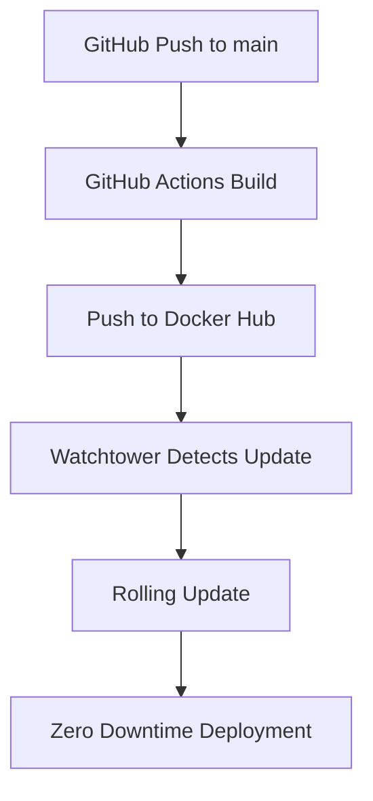

# Modern Deployment Guide

This project uses a modern Docker Hub + Watchtower deployment system for zero-downtime updates.

## Architecture



## Setup Instructions

### 1. Initial Server Setup

```bash
# Clone repository
git clone https://github.com/jschless/armymarkdown.git
cd armymarkdown

# Create environment file
cp .env.example .env
# Edit .env with your production values

# Run initial deployment
chmod +x scripts/deploy.sh
./scripts/deploy.sh
```

### 2. GitHub Secrets Configuration

Add these secrets to your GitHub repository:

- `DOCKERHUB_USERNAME`: Your Docker Hub username
- `DOCKERHUB_TOKEN`: Docker Hub access token (not password)

### 3. Optional: Slack Notifications

Add to your `.env` file:
```bash
SLACK_WEBHOOK_URL=https://hooks.slack.com/services/YOUR/WEBHOOK/URL
```

## How It Works

### Automatic Updates
1. **Push to main branch** triggers GitHub Actions
2. **GitHub Actions builds** and pushes new images to Docker Hub
3. **Watchtower monitors** Docker Hub for new images (every 5 minutes)
4. **Rolling updates** happen automatically with zero downtime

### Manual Updates
```bash
# Force immediate update check
docker compose -f infrastructure/compose/docker-compose-production.yaml exec watchtower watchtower --run-once

# Or rebuild and push manually
docker build -t jschless/armymarkdown-app:latest .
docker push jschless/armymarkdown-app:latest
```

## Services

### Core Services
- **flask_app**: Main application container with Huey task consumer
- **proxy**: Caddy reverse proxy with automatic SSL

### Infrastructure
- **watchtower**: Automatic update monitoring
- **sqlite**: SQLite database (persistent volume)

## Monitoring

### Health Checks
- All services have health checks configured
- Health endpoint: `http://your-domain/health`

### Logs
```bash
# View all logs
docker compose -f infrastructure/compose/docker-compose-production.yaml logs -f

# View specific service logs
docker compose -f infrastructure/compose/docker-compose-production.yaml logs -f flask_app
docker compose -f infrastructure/compose/docker-compose-production.yaml logs -f watchtower
```

### Status
```bash
# Check service status
docker compose -f infrastructure/compose/docker-compose-production.yaml ps

# Check Watchtower updates
docker compose -f infrastructure/compose/docker-compose-production.yaml logs watchtower
```

## Rollbacks

### Automatic Rollback
Watchtower can be configured to automatically rollback failed deployments:

```yaml
environment:
  - WATCHTOWER_ROLLING_RESTART=true
  - WATCHTOWER_TIMEOUT=30s
```

### Manual Rollback
```bash
# Rollback to specific version
docker compose -f infrastructure/compose/docker-compose-production.yaml pull jschless/armymarkdown-app:v1.0.0
docker compose -f infrastructure/compose/docker-compose-production.yaml up -d flask_app celery
```

## Troubleshooting

### Common Issues

**Watchtower not updating:**
```bash
# Check Watchtower logs
docker compose logs watchtower

# Manually trigger update
docker compose exec watchtower watchtower --run-once
```

**Service failing health checks:**
```bash
# Check service logs
docker compose logs flask_app

# Test health endpoint
curl http://localhost:8000/health
```

**Database issues:**
```bash
# Check database volume
docker volume ls | grep armymarkdown
docker compose exec sqlite_db ls -la /data
```

## Security

- All images are scanned for vulnerabilities in GitHub Actions
- Watchtower uses secure labels to scope updates
- Health checks prevent unhealthy deployments
- Non-root user in containers
- Resource limits prevent resource exhaustion

## Performance

- Multi-arch builds (AMD64 + ARM64)
- Layer caching for faster builds
- Optimized Docker images
- Health checks prevent traffic to unhealthy containers
- Rolling updates maintain availability
