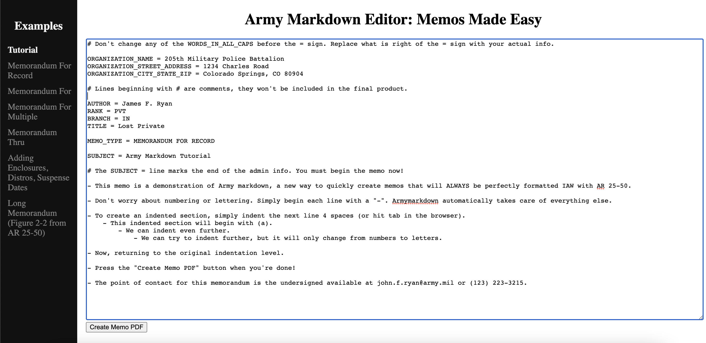
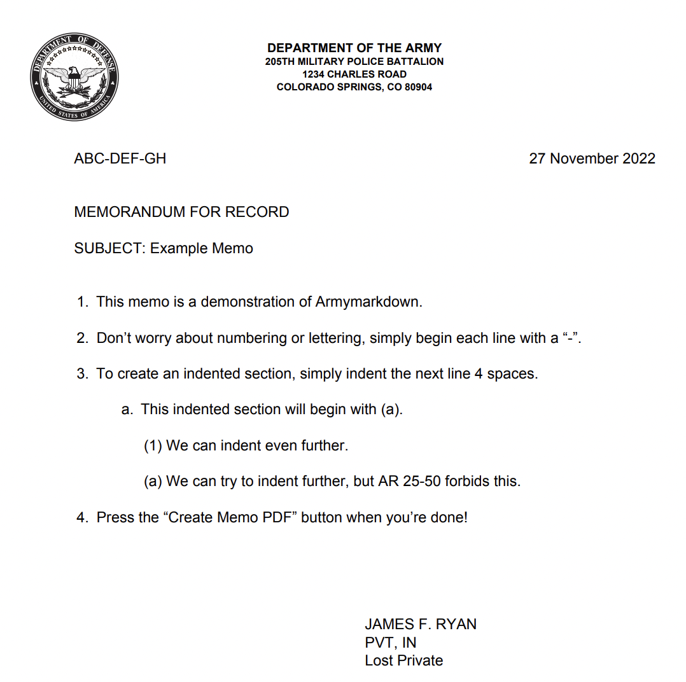

# Project Overview
*Note from author: the website is currently down. Heroku raised their prices about 4-fold and I can no longer justify spending my own money to keep the site up. I have future plans to containerize the website and migrate it to AWS where it will be much cheaper, but this will require a lot of work and will not happen particularly soon.*

The Army relies on memorandums to operate. The guidelines for these memorandums are fairly simple, but they can be tedious to implement in Microsoft Word, which sucks. I am tired of both making mistakes and noticing the mistakes of others. 

While some brilliant soul has already created a [latex class for Army memos](https://github.com/glallen01/army-memorandum-class), latex is intimidating and inaccessible to the average soldier. Hopefully, I can reach a wider audience with this project. The writeup of this project can be found [on my website](https://jschless.github.io/posts/armymarkdown/).

The goal of this project is two-fold:

1. Develop a simple, intuitive markdown-like language for Army memos. Then, a parser will process, proofread, and use latex to output a PDF in accordance with AR 25-50 Managing Correspondance.
2. Create a website where soldiers can upload/type memos and the server will compile the latex and make the memo available for download.

## Features
- Web server where you can create and download memos.
- Spelling and grammar checker. (blocked by DODIN-A)
- Include more obscure memo formats and features.

## Army Markdown Template
I arrived on the following markdown language design, where 

```
ORGANIZATION_NAME=4th Engineer Battalion
ORGANIZATION_STREET_ADDRESS=588 Wetzel Road
ORGANIZATION_CITY_STATE_ZIP=Colorado Springs, CO 80904

OFFICE_SYMBOL=ABC-DEF-GH
DATE
AUTHOR=Joseph C. Schlessinger
RANK=1LT
BRANCH=EN
TITLE=Platoon Leader

MEMO_TYPE=MEMORANDUM FOR RECORD

SUBJECT=Template for Army markdown

- This memo is a demonstration of what.

- This item contains sub items.
    - A subitem is created by simply indenting 4 spaces beyond the previous level.
    - A second subitem within the same item point.
        - Here is a sub sub item

- Back to the original level.

- Point of contact is the undersigned blah blah blah.
```

## Website
Here's what the user interface looks like. I know its a little rough, but DODIN blocks all in-browser text editors I tried! So it has to be a plain HTML textbox.



When you press the button, it generates a pdf version of your memo:


